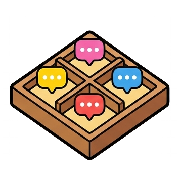
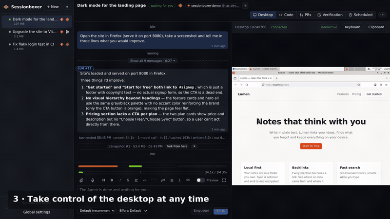

# Sessionboxer

Run coding agents in boxes. Each session gets its own Docker container with a full Linux desktop, and the agent (Claude Code or Devin) works in it like a person would: terminal, editor, browser, mouse and keyboard. You watch the screen live, browse and edit the files, open terminals, and step in when you want to.

<br clear="left" />



*A new session with a first prompt; Claude Code writes and serves a page, opens it in Firefox on the box's desktop and checks it with a screenshot; the editor picks up its next edit live; a terminal inside the box. ([video](docs/assets/demo.mp4))*

## What you get

- **One box per session.** Every conversation runs in its own container with its own copy of the code. Nothing the agent does touches your machine; delete the session and it is all gone.
- **A real desktop.** The container runs a Linux desktop with Firefox. The agent can take screenshots, click and type, so it can test web apps, read documentation or use any GUI tool. You see the same screen in the browser and can take the controls at any time.
- **Agents that don't ask.** Inside the box the agent runs with all permissions granted, so it doesn't stop every few seconds to ask whether it may run a command. The container is the safety boundary.
- **Files, VS Code and terminals.** A file tree with an editor that follows the agent's changes live, full VS Code running inside the box (with the Claude Code extension), and as many shells as you want.
- **Videos and documents in the chat.** Ask for a screen recording of a feature and the agent records the box's desktop to an .mp4 you can play right there; images, SVGs and PDFs it produces show up the same way, with a download button.
- **Stop and resume.** Stop a session to free CPU and memory; resume it later with the conversation, files and installed tools exactly where they were.
- **Docker inside the box** (optional). Agents can run `docker`, `docker compose` and `docker build` inside their own container.
- **Your subscription.** Sessionboxer uses your own Claude or Devin account; there is no Sessionboxer account and nothing leaves your machine except the agent's own traffic.

## Requirements

- Linux with [Docker Engine](https://docs.docker.com/engine/install/) (your user must be able to run `docker`), or macOS with [OrbStack](https://orbstack.dev) or Docker Desktop (see [macOS](#macos))
- Node.js 22+
- A Claude Code subscription and/or a Devin account
- Optional: [Sysbox](https://github.com/nestybox/sysbox) if you want Docker inside sessions without giving the agent a privileged container (see below)

## Install

```sh
git clone https://github.com/talayolabs/sessionboxer.git
cd sessionboxer
npm install
npm run build:image     # builds the sandbox image (~3 GB, takes a few minutes the first time)
npm run build
```

Start it with

```sh
npm start               # http://127.0.0.1:4000
```

and open http://127.0.0.1:4000 in your browser. Sessionboxer only listens on localhost.

To update, `git pull` and run the three build commands again.

## First run: connect your agent

Open **Settings** (bottom of the sidebar) and paste a token for the agent you want to use:

- **Claude Code**: run `claude setup-token` on your machine and paste the result.
- **Devin**: run `devin auth login` on your machine, then paste the token from `~/.local/share/devin/credentials.toml`.

Tokens are stored in `~/.sessionboxer/config.json` (readable only by you) and are only handed to the containers of sessions that use that agent. Settings also holds the git name and email that commits made by agents will carry, and how much CPU and memory each session gets (2 CPUs and 4 GB by default).

## Using it

### Start a session

Click **+ New**, pick the agent, choose where the code comes from:

- **Empty directory**: start from scratch.
- **Clone a git URL**: any URL `git clone` accepts, optionally a branch or tag. Private repositories need credentials embedded in the URL or a public mirror for now.
- **Copy a host directory**: a folder on your machine (type the path or pick it with **Browse…**). Git repositories are copied the way `git` sees them (tracked and untracked files, but nothing ignored by `.gitignore`, so `node_modules` or build output stay behind), plus the `.git` folder so the agent can commit. Other folders are copied whole. The copy is one-way: changes in the box do not flow back.

**Model** lists the models the chosen agent offers (Claude Code: Sonnet/Opus/Haiku/Fable and its default; Devin: the catalog your account has, grouped by family); leave it on *Provider default* to let the agent decide. The list is what the agent reported the last time a session of that provider started, so it is empty until you have run one. Next to it come the agent's other settings, when it has any: for Claude Code, **Effort** (default, low … max) and **Fast mode**. Devin's Cloud tiers (Lite, Normal, Ultra) are not something its CLI offers; pick a model with the effort level you want instead (`…-high`, `…-fast`, …).

Claude Code only lets Sessionboxer pick from the aliases in **Settings → Claude model aliases** (`opus, sonnet, haiku, fable` by default; that list is written to Claude's `availableModels`). Add an alias there if your account has a model the picker does not show; it takes effect for new sessions and for idle sessions right away.

Optionally type the first prompt right there; it is sent as soon as the box is ready. The session title defaults to the first prompt and can be edited later.

### Talk to the agent

The chat shows the agent's messages and, folded, each tool it used: commands, file edits, and the screenshots it took while using the desktop. Press Enter to send, Shift+Enter for a newline. While the agent works, **Send** turns into **Stop**, which interrupts the turn; what you typed stays in the box.

The model picker at the bottom left of the prompt box switches the model for the rest of the conversation, and the pickers next to it (Claude Code: **Effort**, **Fast mode**) do the same for the agent's other settings; the agent decides which appear for the current model (Fable, for one, has no Effort or Fast mode). While the agent is working a change waits until the current turn ends (the picker shows *pending*), and the chat shows a `Model now: …` / `Effort now: …` marker when it takes effect. The choices survive Stop/Resume, and a setting the current model does not offer is kept for when you switch to one that does.

The prompt box is Markdown: write it raw or switch to **Rich text**, use the toolbar for formatting either way, drag the divider to make the box taller, or go full screen with the zen button. **Save for later** (Ctrl+S) keeps a message in the session's *Saved for later* list instead of sending it; from there you can load it back, send it now, reorder, or press **▶ Play all** to send the saved messages one by one, each as soon as the agent finishes the previous one.

### Snapshots and forks

Every time the agent finishes a turn, Sessionboxer takes a **snapshot** of the box (a `docker commit`): files, installed packages, browser state, the agent's own memory of the conversation. Snapshots appear in the chat as `📷 Snapshot #n` markers with their size, and the sidebar shows under each session the total disk it uses (the box's changes on top of its image plus its snapshots). **Snapshot** in the header takes one by hand.

**Fork from here** on a marker (or **Fork…** in the header) starts a *new* session with its *own* box from that snapshot: same files, same tools, same conversation up to that point, and the agent remembers it all. Pick what the fork should do first: nothing, one of the messages that were queued in *Saved for later* when the snapshot was taken (or is queued now), or a new prompt, and optionally copy the rest of the queue over. The original session, its box and its queue are not touched, so you can try two approaches side by side.

Click the size under a session in the sidebar to open its **Snapshots** popup: the machine/snapshots breakdown, a switch to turn automatic snapshots on or off for that session only, the list of its snapshots with their sizes and **Fork** / **Delete** buttons, **Delete all**, and **Snapshot now**. Sessions with automatic snapshots off show `📷×` in the sidebar.

In Settings you set the default for automatic snapshots and how many to keep per session (default 10; older automatic ones are removed, manual snapshots and snapshots a fork was started from are kept). A snapshot's ✕ in the chat deletes it too; snapshots that a fork was started from cannot be deleted while that fork exists. Tokens are never stored in snapshot images.

### Go back and try another way

Each time the agent finishes a turn, a line divides the chat: *turn ended 14:03*. The last one marks where the agent is waiting for you. Every earlier line has **↶ Revert to here**: the chat is cut back to that point and you continue from there, in the same box, with the agent remembering only what came before. Nothing is lost: what followed is kept as another **branch** of the conversation. The divider where they part shows a button to jump to the other branch (**↪ Continue on main**, **⑂ Try it with…**), and a **⑂** selector in the header lists all of them. A branch is named after the first words of the prompt that started it. Sessions with branches get a **▸** chevron in the sidebar: expand it to see the branches as a tree (main, and under it what forked from where). Clicking a branch that parts from the chat you are looking at scrolls to that divider, where the jump button is; clicking one that is out of sight asks to confirm before switching the conversation to it. Only one branch talks to the agent at a time, and you can only revert or switch while it is idle.

Claude keeps the branch's memory exact (its session is forked at that point); Devin is given a transcript of the conversation up to the point instead. Branches share the box, so files changed on one branch stay changed on the others; take a snapshot and fork a new session if you want the files to go back too.

### Videos, images and documents from the box

Ask the agent to *show* you something ("record a video of the login flow", "take a screenshot of the chart", "export the report as PDF") and it saves the file in the project folder and names it in its reply. Any such file mentioned in a reply (`/workspace/recordings/login.mp4`, `docs/report.pdf`) is shown inline in the chat: videos with a player, images and SVGs as pictures, PDFs embedded, audio with controls, each with **Open** and **Download** links. The file is streamed from the box, so the session must be running to view it (a stopped one says so; **Resume** brings it back). The **Files** pane shows the same viewer when you click a media file.

Recordings use the desktop MCP's `start_recording` / `stop_recording` tools (ffmpeg, H.264 .mp4, 15 fps by default, saved under `recordings/`); the agent drives the desktop as usual in between.

### Markdown, diagrams and code

Replies and your prompts render as Markdown. Fenced code with a language (```ts, ```python, ```bash…) is syntax-highlighted in the chat, in the rich prompt editor and in documents; a ```mermaid block is drawn as a diagram (flowcharts, sequence diagrams, Gantt…), with the error and the source shown if the syntax is off. Ask the agent for a document ("write the architecture to docs/arch.md with a diagram") and the `.md` (or `.mmd`) it names in its reply appears rendered in the chat; in the **Files** pane Markdown files open rendered with **Preview | Edit** to switch to the editor, and relative links and images inside them resolve against the box's files.

### Watch and take over the desktop

**Show desktop** opens the box's screen next to the chat. While the agent is working the view is read-only so you don't fight over the mouse; **Take control** hands it to you until the agent's next turn. When the agent is idle the desktop is always interactive: log into a site for it, open a program, arrange windows.

### Files and terminals

**Files** lists the project folder in the box and opens files in an editor. Save with Ctrl+S. When the agent changes a file you have open, the editor reloads it, or warns you if you had unsaved edits.

**Code** opens VS Code on the project folder, running inside the box ([openvscode-server](https://github.com/gitpod-io/openvscode-server), same editor as VS Code for the Web): search, Git view, extensions from [Open VSX](https://open-vsx.org), integrated terminal, and the Claude Code extension preinstalled. The server starts the first time you open the pane (a few seconds) and stops with the box; **Restart** relaunches it and **Open in new tab** gives it a whole window. Settings and extensions you install live in the box, so they survive Stop → Resume and travel with snapshots; the agent sees the same files, so its edits show up as you watch.

**Terminal** opens a shell in the project folder inside the box; open as many tabs as you want. Reloading the page keeps the terminals and their scrollback.

### Stop, resume, delete

- **Stop** pauses the box. It uses no CPU or memory while stopped; the conversation, files, installed packages and everything else in the container are kept.
- **Resume** brings it back where it was. The agent reloads the conversation, so you can continue as if nothing happened.
- **Delete** removes the session, its container and its snapshots for good (forks started from it keep working).

### Docker inside sessions

Some tasks need Docker: running a database for tests, `docker compose up`, building images. Tick **Docker inside the Sandbox** when creating a session, or turn it on for all new sessions in Settings, and the box gets its own Docker daemon. Images and containers created inside survive Stop/Resume and disappear with the session.

There are two ways this can run, and Sessionboxer picks automatically:

- With [Sysbox](https://github.com/nestybox/sysbox) installed on your machine (`sysbox-ce` package from its releases page), the box stays a normal, unprivileged container. Recommended.
- Without Sysbox, the box has to run as a *privileged* container, which means the agent could break out of it onto your machine. Sessionboxer still lets you do it, but shows a ⚠ on the Settings button, explains it next to the option, and marks such sessions in the sidebar and header. Only use this with agents and tasks you trust, or install Sysbox.

### MCP servers

The agent always has the built-in `desktop` MCP server (screen, mouse, keyboard). You can give it more: register **MCP servers** once in Settings, then choose per session which ones are on.

- **Settings → MCP servers**: **Add server** (a name, then either a command to run inside the box such as `npx -y @modelcontextprotocol/server-github` or `uvx mcp-server-fetch`, or the URL of an HTTP/SSE server, plus environment variables or headers) or **Import JSON…** and paste the `{"mcpServers": {...}}` block most servers document for Claude Desktop or Cursor. Mark values like tokens as **secret**: they are stored in `~/.sessionboxer/config.json`, never shown again in the UI, and never end up in snapshot images. **Default** decides whether new sessions start with the server on.
- **New session** shows the registered servers as checkboxes.
- **MCP** in the session header shows how many servers are on and opens a switch per server. Toggle at any time: when the agent is idle it restarts in place and keeps the conversation; while it is working the change waits until the current turn ends (the button shows *pending*). The chat shows an `MCP servers now: …` marker when the set changes.

Servers running on your machine are reachable from the box: `localhost` in a URL means your machine, and `host.docker.internal` works too. `node`, `npx`, `python3`, `uv`/`uvx` and `docker` are available in the box for command-based servers.

#### GitHub with one click

GitHub's own remote MCP server (issues, pull requests, code search, Actions…) needs a login token, and you do not have to paste one: click **Add GitHub** in Settings → MCP servers, give the entry a name, and click **Log in with GitHub**: it runs the GitHub CLI's login (open the link, type the code, approve). The card then shows **Connected as @you**. Add it **more than once with different names** (`github-work`, `github-personal`…) to log in with different GitHub accounts and pick per session which one the agent uses. **Reconnect** logs in again, **Disconnect** forgets the token but keeps the entry. The token is stored like any other secret header and never shown or snapshotted.

The login goes through the GitHub CLI (`gh`) on purpose: organizations that restrict third-party OAuth Apps still allow GitHub's own CLI, so private organization repositories work without asking an owner to approve anything. If `gh` is already logged in on your machine the dialog also offers **Use my gh login as @you** (no browser step); if `gh` is not installed, Sessionboxer downloads the official release (checksum-verified) into `~/.sessionboxer/bin` on first use. Either way it uses a private configuration under `~/.sessionboxer`, so your own `gh` accounts are never touched. **Log in with the Sessionboxer OAuth App** remains as a fallback; to use your own OAuth App instead, register one on GitHub (callback `http://127.0.0.1:4000/api/connectors/github/callback`, Device Flow enabled) and put its Client ID in **Settings → GitHub login**; with the Client secret set too, that login switches from the device code to a plain browser redirect.

While a GitHub entry is enabled for a session, the box itself is logged in as that account too: `gh pr create --draft`, `gh pr view --comments`, `git push` and `git clone` of private HTTPS repositories work in the agent's shell and in the Terminal pane. Switch the entry off in the session's **MCP** popover and the login is gone from the box; it lives on tmpfs, so Snapshots and stopped boxes never carry it. With several GitHub entries enabled, the first one in the registry is the active `gh` account (`gh auth switch` picks another). SSH remotes are not covered; use HTTPS URLs for the box.

#### Behind Cloudflare WARP, Zscaler or another TLS-inspecting proxy

If your machine goes through a proxy that re-signs HTTPS, the agent and MCP servers inside a box would see `self signed certificate in certificate chain`, because the box only trusts the public CAs. Sessionboxer therefore copies the CA certificates your machine trusts *beyond* the public ones (the proxy's root) into every box at start and points Node, Python and OpenSSL at them, so HTTPS from the box works like from your machine. **Settings → TLS certificates in Sandboxes** lists what was found, lets you turn the copy off, and takes extra PEM certificates for CAs not installed on this machine. Changes apply at Sandbox start: Stop → Resume running sessions.

## Command line

The `sessionboxer` command talks to the running server and opens the browser on the new session. Run it as `npx sessionboxer` from the checkout, or `npm link -w @sessionboxer/cli` once to have it on your PATH.

```sh
sessionboxer serve                                   # start the server (same as npm start)
sessionboxer new .                                   # box the current directory
sessionboxer new . -p "run the tests and fix what breaks"
sessionboxer new . --provider devin --docker
sessionboxer new . --model haiku                     # a model id as the provider names it
sessionboxer new . --model opus --option effort=high --option fast=on
sessionboxer new --git https://github.com/org/repo.git --ref main
sessionboxer new --empty -t scratch --no-open
sessionboxer ls
sessionboxer open <id> | stop <id> | resume <id> | rm <id>
```

`SESSIONBOXER_URL` points it at a server other than `http://127.0.0.1:4000`.

## Where things live

| | |
| --- | --- |
| Settings, tokens, MCP servers | `~/.sessionboxer/config.json` |
| Sessions and chat history | `~/.sessionboxer/db.sqlite` |
| Session containers | `sbx-<session id>` on the `sessionboxer` Docker network, no published ports |
| Project folder in the box | `/workspace` |
| Sandbox image | `sessionboxer/sandbox:dev` (built locally) |
| Snapshot images | `sessionboxer/snapshot:<session id>-<n>`; unreferenced ones are removed at startup |

`CLAUDE_CODE_OAUTH_TOKEN` or `WINDSURF_API_KEY` set in the environment of `npm start` take precedence over the tokens in Settings.

## Troubleshooting

- **"docker: permission denied"** when starting: add your user to the `docker` group (`sudo usermod -aG docker $USER`, then log out and in).
- **Session goes to *error* with "sandbox image not found"**: run `npm run build:image`.
- **"method not found: _sessionboxer/…"** after updating Sessionboxer: the box still runs the previous version's internals. Stop and Resume the session; the current build is copied into the box on every start, so `npm run build:image` is only needed when the image itself changes (system packages, agent CLIs).
- **Code pane says "openvscode-server is not installed in this Sandbox image"**: run `npm run build:image`, then Stop → Resume the session.
- **Devin session fails right after creation**: Devin occasionally times out while loading team settings on a cold start. Sessionboxer retries a few times; if it still fails, Resume the session.
- **"self signed certificate in certificate chain"** from an MCP server or the agent inside a box: your machine goes through a TLS-inspecting proxy (Cloudflare WARP, Zscaler…). Check **Settings → TLS certificates in Sandboxes** lists its CA (paste the PEM there if not), then Stop → Resume the session.
- **Docker inside the box can't pull images**: Docker Hub rate-limits anonymous pulls per IP; log in with `docker login` in the box's Terminal or pull from another registry.

### macOS

Sessionboxer talks to each box over the private `sessionboxer` Docker network. On macOS the Docker daemon runs in a VM, and only [OrbStack](https://orbstack.dev) routes container addresses to the host. Sessionboxer checks which daemon it is talking to at startup (the `sandbox reach: ip|localhost` line in the log):

- **OrbStack**: boxes are reached by container address, exactly as on Linux.
- **Docker Desktop, Colima, …**: each box additionally publishes its two internal ports (daemon and desktop) on `127.0.0.1` with random host ports, and the server dials those. Nothing is exposed beyond your machine. `SESSIONBOXER_SANDBOX_REACH=ip` or `=localhost` overrides the detection (for example `ip` with Docker Desktop + [docker-mac-net-connect](https://github.com/chipmk/docker-mac-net-connect)).

Other notes: Colima does not create `/var/run/docker.sock`, so export `DOCKER_HOST=unix://$HOME/.colima/default/docker.sock` before `npm start`. Sysbox is Linux-only, so *Docker inside the Sandbox* always uses the privileged mode on macOS (the box is still inside the Docker VM, not your Mac). The sandbox image builds natively on Apple Silicon (arm64).

## For contributors

Architecture, decisions and the milestone log are in [docs/DESIGN.md](docs/DESIGN.md), the vocabulary in [CONTEXT.md](CONTEXT.md), and the reasoning behind each decision in [docs/adr](docs/adr). Layout is npm workspaces: `apps/control-plane` (server), `apps/web` (UI), `apps/cli`, `packages/sandbox-daemon` and `packages/computer-use-mcp` (run inside the box), `packages/protocol` (shared types), `images/sandbox` (the Docker image). `npm run dev -w @sessionboxer/web` starts the UI with hot reload against a running server.
