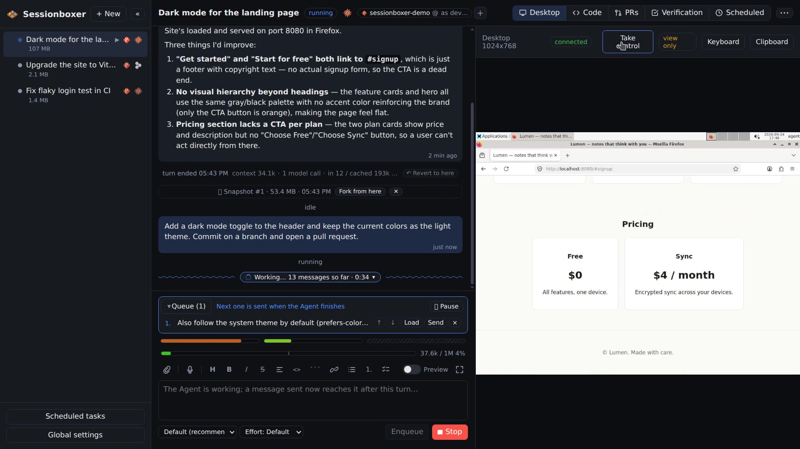

# Sessionboxer

Run coding agents in boxes. Each session gets its own Docker container with a Linux desktop. The agent (Claude Code or Devin) works inside it with a terminal, an editor, a browser, mouse and keyboard. You watch the screen and take over whenever you want.

<br clear="left" />

[](https://sessionboxer.talayolabs.com/demo.mp4)

*Four and a half minutes through the UI: a new session, the desktop, VS Code and the terminal, pull requests with auto-merge, snapshots and forks, several repositories, dictation, the phone. ([MP4](https://sessionboxer.talayolabs.com/demo.mp4) · [GIF](docs/assets/demo.gif))*

## Why

- **Safe.** The agent has all permissions, but only inside its container. Delete the session and everything is gone.
- **Sees the screen.** A real desktop with Firefox. The agent takes screenshots, clicks and types; you can watch and take control.
- **Yours.** Your own Claude or Devin subscription, on your machine or your server. No Sessionboxer account, nothing in the cloud.
- **Open.** MIT licence, plain Docker, plain X11, the [Agent Client Protocol](https://agentclientprotocol.com) between the UI and the agent.

## Install

You need Docker. Pick one:

```sh
curl -fsSL https://sessionboxer.talayolabs.com/install.sh | sh   # picks npm or Docker Compose
npx sessionboxer serve                                            # Node 22+
docker compose up -d                                              # with this repo's docker-compose.yml
```

Or a [desktop app](https://github.com/talayolabs/sessionboxer/releases) for Linux, macOS and Windows (no Node needed).

Then open the login link the server prints, go to **Settings** and paste your agent's token: `claude setup-token` for Claude Code, or the token from `devin auth login` for Devin. Click **+ New**, add a repository, type a prompt.

More ways to install, updating and troubleshooting: [user guide → Install](docs/GUIDE.md#install).

## What it does

- **One box per session.** Its own container, its own copy of the code, one or many repositories.
- **Live desktop.** Watch the agent work; **Take control** to log in somewhere or fix things yourself.
- **VS Code and terminals** inside the box. Files named in the chat open in the editor at that line.
- **Videos in the chat.** Ask for a recording and the agent films the desktop, with captions and optional narration.
- **Verified turns.** Switch it on and after each turn the agent plans test cases from your prompt, runs them on the box's desktop while recording, fixes what fails, and posts the video.
- **Snapshots and forks.** Every finished turn is a snapshot. Fork a new session from any of them.
- **Revert and branches.** Go back to an earlier turn and try another way; the old path is kept as a branch.
- **Pull requests.** Attach a PR and follow its comments from the chat. Have the agent address them, reply on GitHub, and **auto-merge** when checks pass.
- **Context gauge.** How full the agent's memory is, what each turn cost, and every byte sent to the model (Claude Code).
- **MCP servers.** Register once, switch on per session. GitHub connects with one click; one account per repository.
- **Dictation.** Talk instead of typing; whisper.cpp transcribes on your machine, offline.
- **From your phone.** Pair a device with a QR code over a tunnel; push notifications when the agent is done.
- **Stop and resume.** A stopped box uses nothing and comes back where it was.
- **Docker inside the box**, behind a corporate proxy, several GitHub accounts, Bitbucket Data Center.

Every feature in detail: [user guide](docs/GUIDE.md).

## Compared with

| | Sessionboxer | Devin | Cursor Cloud Agents | Codex cloud | Claude Code on the web | OpenHands | T3 Code |
| --- | :-: | :-: | :-: | :-: | :-: | :-: | :-: |
| Runs on your machine or your server | ✓ | ✗ | ✗ | ✗ | ✗ | ✓ | ✓ |
| Your existing subscription, no new account | ✓ | ✗ | ✗ | ✗ | ✗ | API key | ✓ |
| Agents | Claude Code, Devin | Devin | Cursor | Codex | Claude Code | own agent, any model | Claude Code, Codex, Cursor, others |
| Isolated sandbox per session | Docker | VM | VM | container | VM | Docker | ✗ (your machine) |
| Desktop the agent drives with mouse and keyboard | ✓ | browser | ✓ | — | — | browser | ✗ |
| Watch the screen live and take over | ✓ | ✓ | ✓ | — | — | — | ✗ |
| VS Code and terminals inside the sandbox | ✓ | ✓ | — | — | — | — | your own |
| Several repositories in one session | ✓ | ✓ | ✓ | — | — | — | — |
| Snapshot and fork the whole machine | ✓ | — | — | — | — | — | ✗ |
| Revert the conversation, branches | ✓ | — | — | — | — | — | — |
| Pull requests: follow, address, auto-merge | ✓ | follow, address | address | address | address | address | ✗ |
| See the exact model API calls | ✓ | — | — | — | — | — | — |
| Offline dictation | ✓ | — | — | — | — | — | — |
| Phone | PWA + push | web | iOS app | ChatGPT app | Claude app | web | iOS, Android |
| Open source | MIT | ✗ | ✗ | ✗ | ✗ | MIT | MIT |

From each product's public documentation, September 2026; ✗ = not offered, — = not found in the docs. Corrections welcome as an issue.

## Command line

```sh
sessionboxer new .                                   # box the current directory
sessionboxer new --git https://github.com/org/app --git https://github.com/org/api -p "run the tests"
sessionboxer ls | open | stop | resume | rm
sessionboxer service install                         # run the server in the background, at login
```

## Learn more

- [User guide](docs/GUIDE.md): every feature, setting and environment variable.
- [Design](docs/DESIGN.md) and [decision records](docs/adr): how it is built and why.
- [Changelog](CHANGELOG.md) and [releases](https://github.com/talayolabs/sessionboxer/releases).

MIT licence. Made by [Talayo Labs](https://talayolabs.com).
