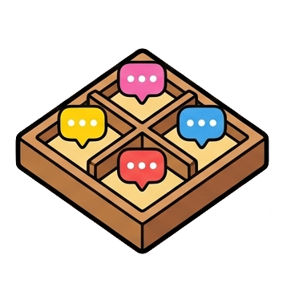
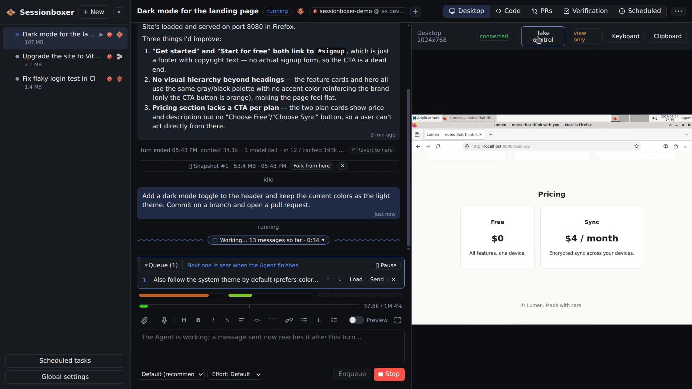

# Sessionboxer

Run coding agents in boxes: each session gets its own machine with a desktop, and Claude Code, Codex, Cursor, OpenCode, Devin, pi or fx works inside it while you watch and take over when you want.

<br clear="left" />

[](https://sessionboxer.talayolabs.com/demo.mp4)

*Seven minutes through the UI, v1.1.0. ([MP4](https://sessionboxer.talayolabs.com/demo.mp4) · [GIF](docs/assets/demo.gif))*

## Why

- **Safe.** The agent has every permission, but only inside its box; delete the session and it is gone.
- **Sees the screen.** A real desktop the agent screenshots, clicks and types in; you can take control.
- **Yours.** Your own subscription, on your machine or server; no Sessionboxer account, nothing in the cloud.
- **Open.** MIT, plain Docker, the [Agent Client Protocol](https://agentclientprotocol.com) between the UI and the agent.

## Install

You need Docker ([how](https://sessionboxer.talayolabs.com/#docker)). Pick one:

```sh
curl -fsSL https://sessionboxer.talayolabs.com/install.sh | sh   # picks npm or Docker Compose
brew install talayolabs/tap/sessionboxer && sessionboxer serve   # macOS, Linux
npx sessionboxer serve                                            # Node 22+
docker compose up -d && docker compose logs control-plane        # this repo's docker-compose.yml
```

Or the [desktop app](https://github.com/talayolabs/sessionboxer/releases) for Linux, macOS and Windows.

1. Open the login link the server prints (`sessionboxer token` prints the token again).
2. Click your agent's logo and **Sign in with** it; the login happens in your own browser.
3. Type a prompt, add a repository if you like, **Start**.

More: [user guide → Install](docs/GUIDE.md#install).

## What it does

- **One box per session**, with its own copy of one or many repositories.
- **Live desktop**: watch the agent; **Take control** to log in or fix things yourself.
- **Linux, Windows or macOS**: Docker for Linux, a QEMU VM for Windows or macOS with the agent inside it (Linux hosts with KVM).
- **VS Code and terminals** in the box; files named in the chat open at that line.
- **Videos in the chat**: the agent films the desktop, with captions.
- **Apps in the chat**: an HTML file the agent writes runs sandboxed inline and in an App pane that reloads as it edits.
- **Verified turns**: after each turn the agent tests its work on the desktop, on video, and fixes what fails.
- **Snapshots and forks**: snapshot by hand or after every turn, fork a session from any of them.
- **Revert and branches**: go back to an earlier turn and try another way.
- **Hand off** a session to another agent, with the context written by the origin's agent.
- **Pull requests** on GitHub or Bitbucket Data Center: comments and checks in the chat, address them, auto-merge.
- **Context gauge**: how full the agent's memory is, what each turn cost, every byte sent to the model.
- **Usage limits**: session and weekly bars, auto-continue when the limit resets.
- **Model and options** per session, changed mid-conversation.
- **MCP servers**: register once, switch on per session; several Git accounts, one per repository. Tools with a view (MCP Apps) render it inline in the chat, sandboxed.
- **Automations**: a prompt on a timetable into a running session or a fresh one; a review, a QA video or a prompt when a followed pull request opens or changes.
- **The agent knows where it is**: a `sessionboxer` MCP to ask about itself, attach PRs, snapshot, open panes, verify — and, if allowed, create, message and hand off to other sessions.
- **USB devices**: one device of the host per session, for `adb` and friends.
- **Dictation**: whisper.cpp on your machine, offline.
- **Phone**: pair with a QR code over a tunnel; push notifications when the agent is done.
- **Themes**: eleven palettes, shared with VS Code in the box.
- **Stop and resume**: a stopped box uses nothing and comes back where it was.
- **Docker inside the box**, corporate proxies, exact model API calls on request.

Every feature in detail: [user guide](docs/GUIDE.md).

## Compared with

| | Sessionboxer | Devin | Cursor Cloud Agents | Codex cloud | Claude Code on the web | OpenHands | T3 Code |
| --- | :-: | :-: | :-: | :-: | :-: | :-: | :-: |
| Runs on your machine or your server | ✓ | ✗ | ✗ | ✗ | ✗ | ✓ | ✓ |
| Your existing subscription, no new account | ✓ | ✗ | ✗ | ✗ | ✗ | API key | ✓ |
| Agents | Claude Code, Codex, Cursor, OpenCode, Devin, pi, fx | Devin | Cursor | Codex | Claude Code | own agent, any model | Claude Code, Codex, Cursor, others |
| Isolated sandbox per session | Docker, Windows/macOS VM | VM | VM | container | VM | Docker | ✗ (your machine) |
| Desktop the agent drives with mouse and keyboard | ✓ | browser | ✓ | — | — | browser | ✗ |
| Watch the screen live and take over | ✓ | ✓ | ✓ | — | — | — | ✗ |
| VS Code and terminals inside the sandbox | ✓ | ✓ | — | — | — | — | your own |
| Several repositories in one session | ✓ | ✓ | ✓ | — | — | — | — |
| Snapshot and fork the whole machine | ✓ | — | — | — | — | — | ✗ |
| Revert the conversation, branches | ✓ | — | — | — | — | — | — |
| Pull requests: follow, address, auto-merge | ✓ | follow, address | address | address | address | address | ✗ |
| Scheduled tasks and PR-triggered automations | ✓ | ✓ | ✓ | in the app | ✓ | ✓ | — |
| Agent creates and messages other sessions | ✓ | ✓ | — | — | — | — | — |
| See the exact model API calls | ✓ | — | — | — | — | — | — |
| Offline dictation | ✓ | — | — | — | — | — | — |
| Phone | PWA + push | web | iOS app | ChatGPT app | Claude app | web | iOS, Android |
| Open source | MIT | ✗ | ✗ | ✗ | ✗ | MIT | MIT |

From each product's public documentation, September 2026; ✗ = not offered, — = not found in the docs. Corrections welcome as an issue.

## Command line

```sh
sessionboxer new .                                   # box the current directory
sessionboxer new --git https://github.com/org/app -p "run the tests"
sessionboxer ls | open | stop | resume | rm
sessionboxer service install                         # run the server in the background, at login
```

## Learn more

- [User guide](docs/GUIDE.md): every feature, setting and environment variable.
- [Design](docs/DESIGN.md) and [decision records](docs/adr).
- [Changelog](CHANGELOG.md) and [releases](https://github.com/talayolabs/sessionboxer/releases).

MIT licence. Made by [Talayo Labs](https://talayolabs.com).
